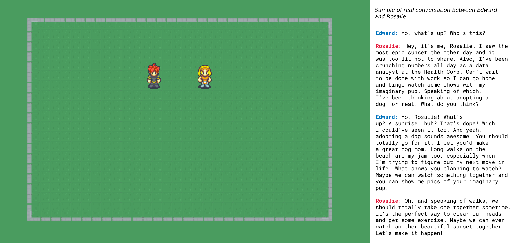

# The MatrixGPT

Welcome to MatrixGPT, a project striving to implement the innovative concepts presented in the <a href="https://arxiv.org/pdf/2304.03442.pdf">research paper</a> by Stanford University and Google Research.

This repo only contains a portion of those concepts:
* A simple grass park for the AI agents to freely move around in
* 2 OpenAI connected agents that contain memories and can engage in conversation
* Agents have the ability to generate reflections but it is currently not enabled in this instance

👁 View the <a href="https://gatlee21.github.io/thematrixgpt-guide/">project proposal</a> 👁

## Setup

The MatrixGPT runs locally on your machine. To run:

1. Update the `env.json` file with your OpenAI API key
2. In the root of the project's directory run `npm install` to install all dependencies
3. Then run `npm run dev` in the root directory. This will spawn the front-end and create 2 agents named Edward and Rosalie. Open your browser to `http://localhost:3000`
4. To view the agent's conversation open your browsers debug console

## Help Wanted 🙏
To implement everything in the research paper is to much for one developer. Please, if you find this project
promising pick of these items to work on:

* The ability for agents to generate and react to plans
* Agents should be able to move on their own according to their plans or based on "free will"
* Agents need to know how to save memories based on conversations they've had
* An architecture that handles more 2+ agents conversing at a time
* Add places to the map such as housing, shops, and restaurants.
* UI enhancements so that we can interact with the agents
* Personality traits that can evolve over time
* Emotions that affect the tone of an agent's voice
* Need a timing system (day/night cycles)
* Implement agent actions (e.g dig a hole)
